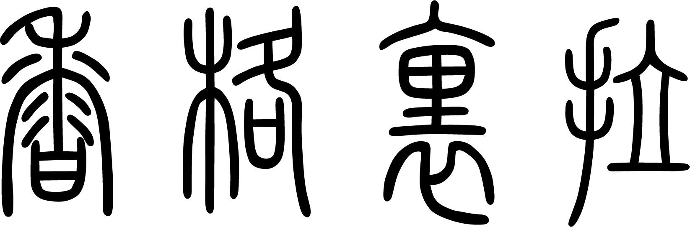

<h1>Shangri-la</h1>
<p>
  
</p>

> Einere's homepage for portfolio

### 🏠 [Homepage](https://einere.github.io/homepage)

## Introduction

저의 포트폴리오용 정적 SPA입니다.

## Environment

### Front

- HTML
- CSS
- TypeScript
- React
- styled-components

### VCS

- Git
- GitHub

## Architecture

(추후 이미지 삽입)
정적 웹페이지 이므로 따로 data fetch를 위한 서버는 구성하지 않았습니다.

## Feature

- 반응형 웹이며, desktop-first design을 적용했습니다.
  - 사용자의 스크롤링에 반응하는 반응형 네비게이션 바를 구현했습니다.
- styled-components에서 지원하는 theming기능을 이용해, 스타일 시스템을 구축했습니다.

## Install

```sh
yarn install
```

## Usage

```sh
yarn start
```

## Run tests

```sh
yarn test
```

## Author

👤 **Einere**

* Github: [@Einere](https://github.com/Einere)

## License

[MIT license](./LICENSE)

## 🤝 Contributing

Contributions, issues and feature requests are welcome!  
Feel free to check [issues page](https://github.com/Einere/homepage/issues). 

## Show your support

Give a ⭐️ if this project helped you!

***
_This README was generated with ❤️ by [readme-md-generator](https://github.com/kefranabg/readme-md-generator)_
